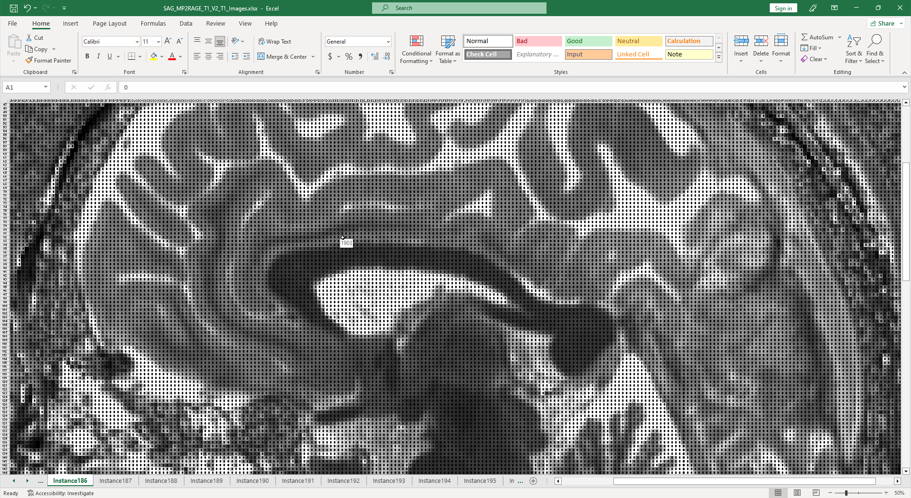

# dcm2xlsx

## About
***dcm2xlsx*** converts medical imaging data from DICOM format into 
spreadsheets that can be opened with Microsoft Excel, LibreOffice Calc, or any 
other program that handles the Office Open XML format.

By increasing the accessibility of these files, we hope to empower even more 
investigators to form questionable inferences through the indiscriminate 
application of mathematics to medical imaging data.

## Requirements
[Python 3](https://www.python.org/downloads/) must be installed.

## Download
* [`dcm2xlsx`](https://github.com/vishalp/dcm2xlsx/releases/latest/download/dcm2xlsx) - terminal
* [`dcm2xlsxGUI`](https://github.com/vishalp/dcm2xlsx/releases/latest/download/dcm2xlsxGUI) - graphical

---
Built with:
* [pydicom](https://pydicom.github.io/)
* [XlsxWriter](https://github.com/jmcnamara/XlsxWriter)

Inspired by:
* [dcm2niix](https://github.com/rordenlab/dcm2niix)
* [Matt Parker](https://www.youtube.com/watch?v=UBX2QQHlQ_I)
